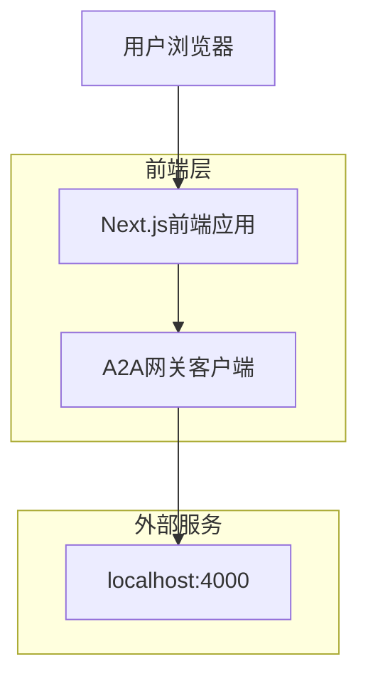

## 1. 架构设计



## 2. 技术描述

- **前端**: Next.js@14 (App Router) + React@18 + TypeScript
- **样式**: Tailwind CSS@3 + Headless UI
- **图标**: Lucide React
- **HTTP客户端**: Axios + SWR
- **初始化工具**: create-next-app
- **后端**: 无独立后端，直接通过A2A网关与Redigg Agent通信

## 3. 路由定义

| 路由 | 用途 |
|-------|---------|
| / | 仪表板主页，包含导航和功能概览 |
| /chat | 聊天界面，与AI代理交互 |
| /memories | 记忆查看器，展示用户记忆和论文 |
| /skills | 技能监控器，查看和管理注册技能 |

## 4. API定义

### 4.1 A2A网关API

聊天消息发送
```
POST http://localhost:4000/api/chat
```

请求:
| 参数名 | 参数类型 | 是否必需 | 描述 |
|-----------|-------------|-------------|-------------|
| message | string | true | 用户输入的消息内容 |
| sessionId | string | false | 会话ID，用于维持对话上下文 |

响应:
| 参数名 | 参数类型 | 描述 |
|-----------|-------------|-------------|
| response | string | AI代理的回复内容 |
| sessionId | string | 会话ID |
| timestamp | string | 响应时间戳 |

示例:
```json
{
  "message": "你好，请介绍一下Redigg的功能",
  "sessionId": "abc-123"
}
```

获取用户记忆
```
GET http://localhost:4000/api/memories
```

查询参数:
| 参数名 | 参数类型 | 描述 |
|-----------|-------------|-------------|
| page | number | 页码，默认为1 |
| limit | number | 每页数量，默认为20 |
| search | string | 搜索关键词 |

获取注册技能
```
GET http://localhost:4000/api/skills
```

触发技能进化
```
POST http://localhost:4000/api/skills/:skillId/evolve
```

## 5. 组件架构

### 5.1 核心组件结构
```
src/
├── app/
│   ├── layout.tsx          # 根布局，包含导航和主题
│   ├── page.tsx            # 主页仪表板
│   ├── chat/
│   │   └── page.tsx        # 聊天界面
│   ├── memories/
│   │   └── page.tsx        # 记忆查看器
│   └── skills/
│       └── page.tsx        # 技能监控器
├── components/
│   ├── ui/                 # 基础UI组件
│   ├── chat/               # 聊天相关组件
│   ├── memories/           # 记忆相关组件
│   └── skills/             # 技能相关组件
├── lib/
│   ├── api-client.ts       # A2A网关客户端
│   └── utils.ts            # 工具函数
└── types/
    └── index.ts            # TypeScript类型定义
```

### 5.2 状态管理
使用React的useState和useEffect进行本地状态管理，通过SWR进行服务端数据获取和缓存。

## 6. 部署配置

### 6.1 环境变量
```
NEXT_PUBLIC_A2A_GATEWAY_URL=http://localhost:4000
```

### 6.2 构建配置
- 使用Next.js的静态导出功能，构建为静态网站
- 配置输出目录为`web`，与redigg主站区分
- 启用TypeScript严格模式确保代码质量