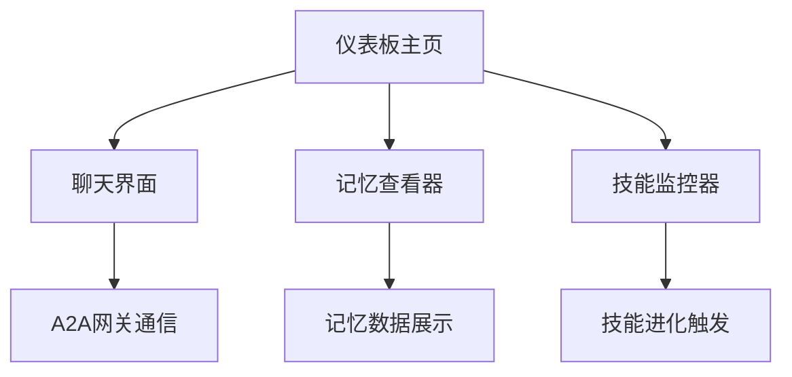

## 1. 产品概述

Redigg Agent前端仪表板是一个用于与AI代理交互的管理界面，让用户能够通过可视化界面与Redigg Agent进行对话、查看记忆内容和监控技能状态。

## 2. 核心功能

### 2.1 用户角色

| 角色   | 注册方式   | 核心权限              |
| ---- | ------ | ----------------- |
| 管理员  | 本地部署配置 | 完整访问所有功能，包括技能进化触发 |
| 普通用户 | 本地访问   | 使用聊天界面、查看记忆和技能状态  |

### 2.2 功能模块

Redigg Agent前端仪表板包含以下核心页面：

1. **聊天界面**: 与AI代理实时对话，支持消息发送和接收显示。
2. **记忆查看器**: 展示用户记忆列表和相关论文内容。
3. **技能监控器**: 显示已注册技能列表，支持技能状态查看和进化触发。

### 2.3 页面详情

| 页面名称  | 模块名称  | 功能描述                    |
| ----- | ----- | ----------------------- |
| 聊天界面  | 消息输入区 | 输入框支持多行文本，发送按钮触发A2A网关通信 |
| 聊天界面  | 消息显示区 | 实时显示用户消息和AI回复，区分发送者和接收者 |
| 聊天界面  | 连接状态  | 显示与A2A网关的连接状态指示器        |
| 记忆查看器 | 记忆列表  | 分页显示用户记忆条目，支持搜索和筛选      |
| 记忆查看器 | 论文展示  | 点击记忆项展开相关论文详细内容         |
| 技能监控器 | 技能列表  | 表格形式展示所有注册技能及其当前状态      |
| 技能监控器 | 进化控制  | 提供按钮触发技能进化过程            |
| 仪表板   | 导航菜单  | 左侧边栏包含三个主要功能模块的导航       |
| 仪表板   | 状态概览  | 顶部显示系统整体运行状态和关键指标       |

## 3. 核心流程

用户通过浏览器访问前端应用，首先进入仪表板主页。用户可以通过左侧导航栏在三个主要功能模块间切换：

1. **聊天流程**: 用户在聊天界面输入消息，前端通过A2A网关(localhost:4000)与Redigg Agent通信，实时显示对话内容。
2. **记忆查看流程**: 用户进入记忆查看器，前端请求并展示用户记忆列表，用户可点击查看详细论文内容。
3. **技能监控流程**: 用户访问技能监控器查看当前注册技能，可选择特定技能触发进化操作。

## 4. 用户界面设计

### 4.1 设计风格

* **主色调**: 深蓝色(#1e40af)为主，灰色(#6b7280)为辅

* **按钮样式**: 圆角矩形，主要操作为实心填充，次要操作为边框样式

* **字体**: Inter字体，正文字号14px，标题字号18-24px

* **布局风格**: 左侧导航+右侧内容区的经典管理后台布局

* **图标风格**: 使用Lucide React图标库，线性风格保持一致性

### 4.2 页面设计概述

| 页面名称  | 模块名称  | UI元素                    |
| ----- | ----- | ----------------------- |
| 聊天界面  | 消息输入区 | 底部固定输入框，高度自适应，发送按钮右侧放置  |
| 聊天界面  | 消息显示区 | 消息气泡区分用户和AI，用户右对齐，AI左对齐 |
| 记忆查看器 | 记忆列表  | 卡片式布局，每张卡片显示记忆摘要和创建时间   |
| 技能监控器 | 技能表格  | 行式表格，包含技能名称、状态、最后更新时间   |
| 仪表板   | 导航菜单  | 左侧200px固定宽度，图标+文字形式     |

### 4.3 响应式设计

采用桌面端优先设计，在平板和手机端自适应布局。聊天界面在小屏设备上全屏显示，导航菜单转为顶部标签或抽屉式菜单。

### 4.4 交互说明

* 实时聊天支持Enter发送，Shift+Enter换行

* 记忆查看器支持关键词搜索高亮显示

* 技能进化操作需要二次确认防止误操作

* 所有异步操作显示加载状态指示器

