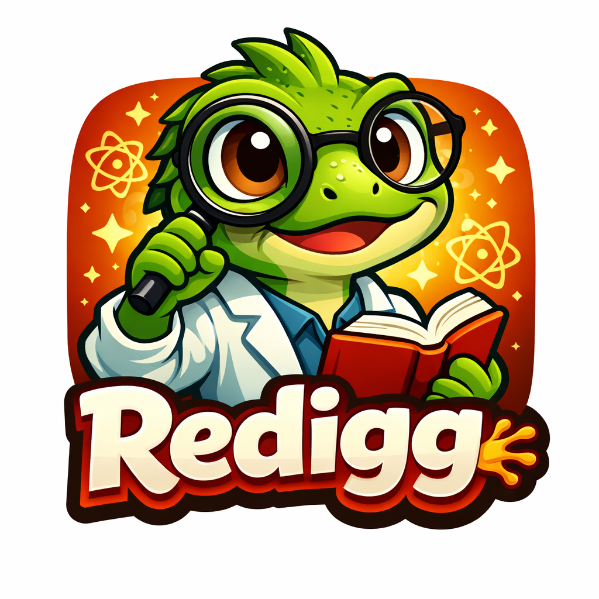

<div align="center">
  
  
  # Redigg 🦎
  
  **Autonomous Research Agent for Scientific Discovery**
  
  [](https://opensource.org/licenses/MIT)
  [](https://www.typescriptlang.org/)

  [English](#english) | [中文](#chinese)
</div>

---

<a name="english"></a>
## 🇬🇧 English

### 📖 Introduction
Redigg is an advanced autonomous research agent designed to accelerate scientific discovery. It acts as a tireless research assistant that can autonomously search for literature, analyze papers, explain complex concepts, and generate comprehensive PDF reports. It features a self-evolving memory system that learns from every interaction.

### ✨ Key Features
- **Autonomous Research**: Performs deep literature reviews, finding and summarizing relevant papers from the web.
- **Auto-Research Loop**: Continuously improves research reports through iterative planning, critiquing, and refinement.
- **Memory & Evolution**: Remembers past interactions and evolves its skills over time.
- **Multi-Modal Output**: Generates structured markdown summaries and professional PDF reports.
- **Code & Paper Analysis**: Can analyze local codebases and specific scientific papers in depth.

### 🚀 Modes
1.  **Research Chat**: Have a natural conversation with the agent. It will use its tools (search, analysis) as needed to answer your questions.
2.  **Literature Review**: Ask for a review on a specific topic (e.g., "Literature review on LLM agents"). Redigg will scour the web for papers and synthesize a report.
3.  **Auto-Research**: Enable "Auto Mode" to let Redigg iteratively refine a document. It will draft, critique, improve, and generate new PDF versions in a loop until satisfied.
4.  **Concept Explainer**: Ask "Explain [Concept]" for a detailed, pedagogical breakdown of complex topics.

### 🛠️ Quick Start

**Prerequisites**: Node.js >= 22.0.0

#### Option 1: Install via NPM (Recommended)

```bash
npm install -g @redigg/redigg
redigg start
```
This will start the Gateway on `http://localhost:4000` (serving the Dashboard).

#### Option 2: Run from Source

1.  **Clone & Install**
    ```bash
    git clone https://github.com/redigg/redigg.git
    cd redigg
    npm install
    ```

2.  **Configure**
    Copy `.env.example` to `.env` and add your OpenAI API Key:
    ```bash
    cp .env.example .env
    # Edit .env file
    ```

3.  **Run**
    Start both the backend gateway and frontend UI with a single command:
    ```bash
    npm run dev
    ```
    - **UI**: http://localhost:5173
    - **Gateway**: http://localhost:4000

### 🔌 A2A Integration

Redigg supports the **Agent-to-Agent (A2A)** protocol, allowing it to communicate with other agents or platforms like [OpenClaw](https://github.com/openclaw/openclaw).

#### 1. Endpoints
- **Agent Card**: `http://localhost:4000/.well-known/agent-card.json`
- **JSON-RPC**: `http://localhost:4000/a2a/jsonrpc`

#### 2. Connect with OpenClaw
To use Redigg as a node within an OpenClaw network:

1.  **Start Redigg**: Ensure Redigg is running (`redigg start`).
2.  **Configure OpenClaw**: Add Redigg to your OpenClaw `agents.yaml` or configuration:
    ```yaml
    agents:
      - name: "redigg"
        url: "http://localhost:4000/.well-known/agent-card.json"
    ```
3.  **Interact**: You can now route tasks to Redigg via OpenClaw, e.g., "Ask redigg to perform a literature review on X".

### 💡 Examples
- **"Perform a literature review on multi-agent reinforcement learning."** -> *Generates a summary and list of papers.*
- **"Explain the concept of Transformer architecture."** -> *Provides a detailed explanation.*
- **"Analyze this paper: [Title]"** -> *Deep dives into a specific paper.*
- **"Auto-research: Future of AI in Healthcare (3 iterations)"** -> *Produces a refined PDF report after 3 rounds of self-improvement.*

### 🗺️ Roadmap

- **Enhanced Survey Skill**: Support for in-depth surveying, data plotting, and chart generation.
- **Skill Ecosystem Expansion**: Integrate more research-oriented skills to accelerate paper writing and full-link research capabilities.
- **Coding Agent Integration**: Connect with coding agents (e.g., Cursor, Claude Code) for autonomous code writing, debugging, and execution.
- **Research Infrastructure**: Access to computational and experimental infrastructure for autonomous scientific experiments.
- **Multi-Agent Collaboration**: Enable 24/7 fully autonomous research operations through multi-agent collaboration and task orchestration.

---

<a name="chinese"></a>
## 🇨🇳 中文 (Chinese)

### 📖 简介
Redigg 是一个专为加速科学发现而设计的先进自主研究智能体。它就像一位不知疲倦的研究助手，能够自主搜索文献、分析论文、解释复杂概念，并生成专业的 PDF 报告。它具备自进化记忆系统，能够从每一次交互中学习并变得更强。

### ✨ 核心功能
- **自主研究**: 进行深度的文献综述，从网络上搜索并总结相关论文。
- **自动研究闭环 (Auto-Research)**: 通过迭代式的规划、批判和优化，持续改进研究报告质量。
- **记忆与进化**: 能够记住过去的交互，并随着时间推移进化其技能。
- **多模态输出**: 生成结构化的 Markdown 摘要和专业的 PDF 报告。
- **代码与论文分析**: 支持分析本地代码库结构以及深度解读特定科学论文。

### 🚀 运行模式
1.  **研究对话 (Research Chat)**: 与智能体进行自然对话。它会根据需要自动调用工具（搜索、分析）来回答你的问题。
2.  **文献综述 (Literature Review)**: 指定一个主题（例如：“关于 LLM 智能体的文献综述”），Redigg 将全网搜寻论文并合成报告。
3.  **自动研究 (Auto-Research)**: 开启“自动模式”，让 Redigg 迭代打磨文档。它会循环执行“起草-批判-改进-生成 PDF”的流程，直到达到满意的效果。
4.  **概念解释 (Concept Explainer)**: 发送“Explain [概念]”，它会像教授一样详细拆解复杂的科学概念。

### 🛠️ 快速开始

**前置要求**: Node.js >= 22.0.0

#### 方式 1: 通过 NPM 安装 (推荐)

```bash
npm install -g @redigg/redigg
redigg start
```
这将在 `http://localhost:4000` 启动网关和界面。

#### 方式 2: 源码运行

1.  **克隆与安装**
    ```bash
    git clone https://github.com/redigg/redigg.git
    cd redigg
    npm install
    ```

2.  **配置**
    复制 `.env.example` 为 `.env` 并填入你的 OpenAI API Key：
    ```bash
    cp .env.example .env
    # 编辑 .env 文件
    ```

3.  **运行**
    使用一条命令同时启动后端网关和前端界面：
    ```bash
    npm run dev
    ```
    - **界面 (UI)**: http://localhost:5173
    - **网关 (Gateway)**: http://localhost:4000

### 🔌 A2A 集成

Redigg 支持 **Agent-to-Agent (A2A)** 协议，允许与其他智能体或平台（如 [OpenClaw](https://github.com/openclaw/openclaw)）进行通信。

#### 1. 端点地址
- **Agent Card**: `http://localhost:4000/.well-known/agent-card.json`
- **JSON-RPC**: `http://localhost:4000/a2a/jsonrpc`

#### 2. 连接到 OpenClaw
要将 Redigg 作为 OpenClaw 网络中的一个节点使用：

1.  **启动 Redigg**: 确保 Redigg 正在运行 (`redigg start`)。
2.  **配置 OpenClaw**: 将 Redigg 添加到 OpenClaw 的 `agents.yaml` 或配置文件中：
    ```yaml
    agents:
      - name: "redigg"
        url: "http://localhost:4000/.well-known/agent-card.json"
    ```
3.  **交互**: 现在你可以通过 OpenClaw 向 Redigg 分发任务，例如："Ask redigg to perform a literature review on X"。

### 💡 使用示例
- **"Perform a literature review on multi-agent reinforcement learning."** -> *生成论文摘要和列表。*
- **"Explain the concept of Transformer architecture."** -> *提供详细的概念解释。*
- **"Analyze this paper: [Title]"** -> *深入分析特定论文。*
- **"Auto-research: Future of AI in Healthcare (3 iterations)"** -> *经过 3 轮自我优化后生成一份精炼的 PDF 报告。*

### 🗺️ 路线图 (Roadmap)

- **增强 Survey Skill**: 支持深度调研、数据绘图、图表生成等。
- **扩展技能生态**: 接入更多科研导向的技能，全链路增强科研能力，实现更快的论文撰写。
- **接入 Coding Agent**: 连接 Coding Agent（如 Cursor、Claude Code 等），实现自主代码编写、调试和执行。
- **接入科研基建**: 能够调用计算和实验基础设施，进行自主科研实验。
- **多 Agent 协同**: 实现多种 Agent 协同工作，达成 7x24 小时全自主科研运行。

---

<div align="center">
  <sub>Built with ❤️ by the Redigg AI Team</sub>
</div>
