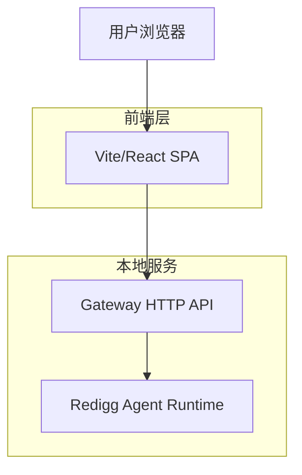

## 1. 架构设计



## 2. 技术描述

- **前端**: Vite + React@19 + TypeScript
- **样式**: Tailwind CSS@4（通过 `@tailwindcss/vite`）
- **图标**: Lucide React
- **HTTP 客户端**: 浏览器 `fetch`（无 SWR）
- **后端**: Express Gateway（同进程内调用 `ResearchAgent`）

## 3. 页面形态

- 当前实现为单页应用（SPA），主要通过组件内部状态切换不同面板（Chat / Memories / Skills / Sessions）。

## 4. API定义

### 4.1 Web Dashboard API（Gateway `/api/*`）

异步聊天（推荐）
```
POST /api/chat/async
```

请求:
| 参数名 | 参数类型 | 是否必需 | 描述 |
|-----------|-------------|-------------|-------------|
| message | string | true | 用户输入的消息内容 |
| sessionId | string | false | 会话ID，用于维持对话上下文 |
| webSearch | boolean | false | 是否附加 Web Search 指令 |
| attachments | array | false | 上传文件列表（用于上下文提示） |

响应：`202 Accepted`

示例:
```json
{
  "message": "你好，请介绍一下Redigg的功能",
  "sessionId": "abc-123"
}
```

会话事件流（SSE）
```
GET /api/sessions/:sessionId/events
```

会话列表与历史
```
GET /api/sessions
GET /api/sessions/:sessionId/history
POST /api/sessions
POST /api/sessions/:sessionId/stop
DELETE /api/sessions/:sessionId
```

上传
```
POST /api/upload
```

获取用户记忆
```
GET /api/memories
```

获取注册技能
```
GET /api/skills
```

技能包
```
GET /api/skill-packs
```

生成文件（PDF 等）
```
GET /files/*
```

## 5. 组件架构

### 5.1 核心组件结构
```
src/
├── components/
│   ├── ui/                 # 基础UI组件
│   ├── chat/               # 聊天相关组件
│   └── ai/                 # AI 相关渲染组件
├── lib/
│   └── utils.ts            # 工具函数
├── App.tsx                 # 单页容器与状态编排
└── main.tsx                # 入口
```

### 5.2 状态管理
使用React的useState和useEffect进行本地状态管理，通过SWR进行服务端数据获取和缓存。

## 6. 部署配置

### 6.1 环境变量

- 当前实现默认使用相对路径请求 `/api/*`，在开发态通过 Vite proxy 转发到 `http://localhost:4000`。

### 6.2 构建配置

- 前端构建产物为 `web/dist`，由 Gateway 在生产态以静态资源方式托管。
- 本地联调使用根目录 `npm run dev` 并发启动后端与前端。
